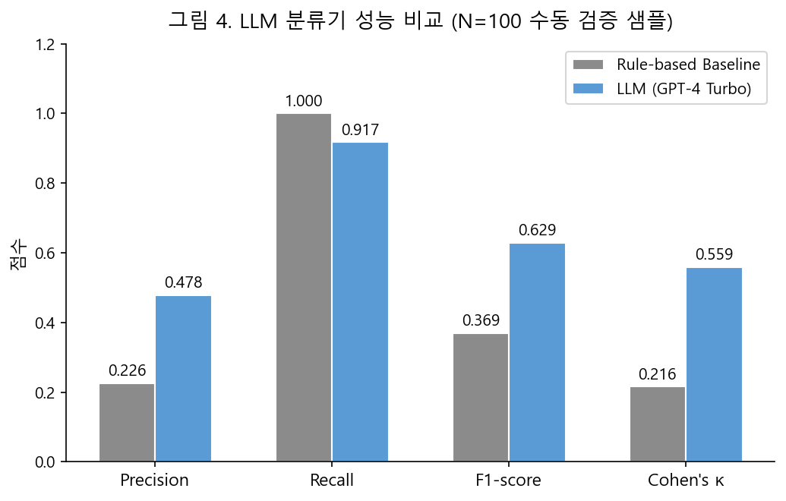
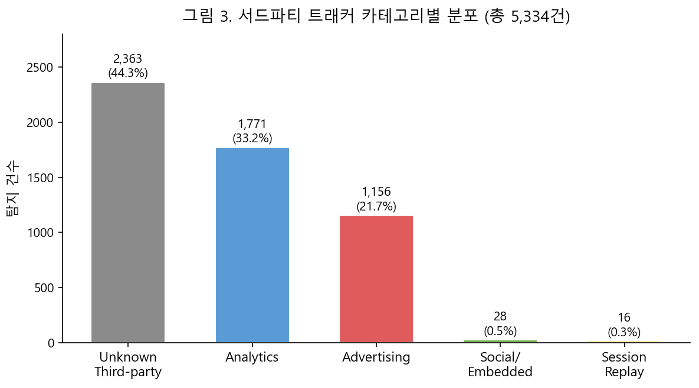
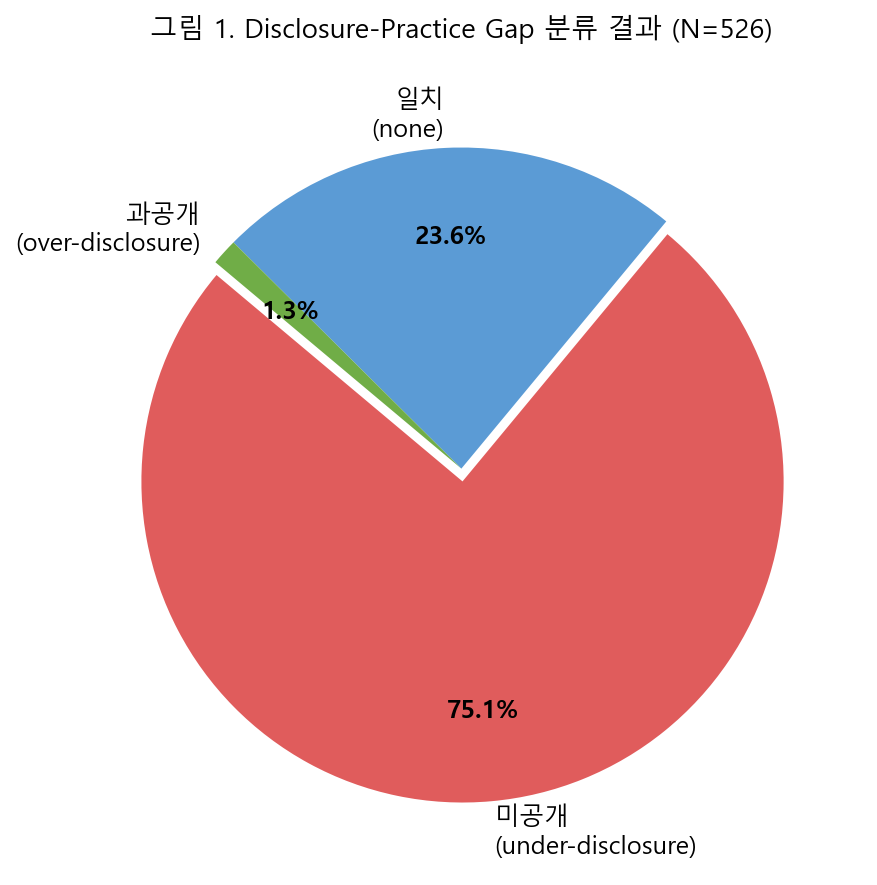
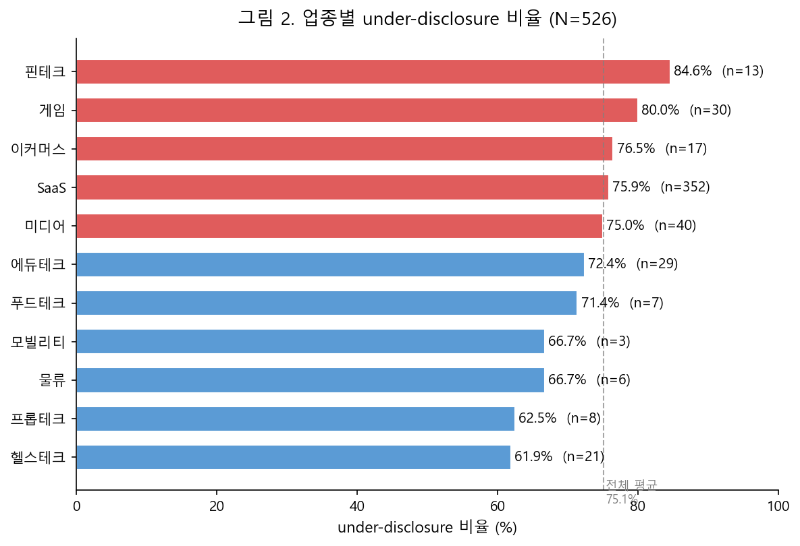

**동적 웹 스크래핑과 LLM 분석을 활용한**

**국내 스타트업 개인정보 처리방침 준수 실태 분석**

_Empirical Analysis of Privacy Policy Compliance in Korean Startups_

_Using Dynamic Web Scraping and LLM Analysis_

백동재1 · 오준형2

_Dongjae Baek · Junhyung Oh_

1테크파이 2서울여자대학교 정보보호학부

**Abstract**

본 연구는 대규모 언어 모델(LLM)과 동적 웹 스크래핑 파이프라인을 결합하여, 국내 스타트업의 개인정보 처리방침 준수 실태를 최초로 자동화·실증한 연구다. 중소벤처기업부 벤처기업 명단 및 수동 수집을 통해 확보한 1,000개 스타트업을 대상으로, 개인정보 처리방침의 게시 여부, 서드파티 트래커 운영 현황, 그리고 양자 간의 불일치(Disclosure-Practice Gap)를 측정하였다. 분석 가능한 526개 사이트 중 87.5%(460개)에서 서드파티 트래커가 탐지되었으며, 트래커를 운영하는 기업의 85.9%가 처리방침에 이를 명시하지 않은 under-disclosure 상태로 확인되었다. 전체 분석 대상의 75.1%가 under-disclosure에 해당하며, 크롤링 실패 사이트를 포함하면 실제 비율은 최대 86.3%에 이를 것으로 추정된다. 이는 국내 스타트업의 개인정보 처리 선언과 실제 데이터 수집 행위 사이에 구조적 괴리가 존재함을 실증한다. 본 파이프라인은 Playwright 기반 headless Chromium 환경에서 동적 렌더링 이후 DOM을 수집하고, asyncio 기반 병렬 크롤링 구조로 확장성을 확보하였다. LLM 분석 단계에서는 prompt-engineered evaluation rubric을 적용하여 JSON schema 기반 구조화된 출력으로 후처리 및 통계 분석을 수행하였다. 본 연구는 기존 수작업 조사의 한계를 AI 자동화로 극복하고, 실증 근거를 제시함으로써 개인정보보호 정책 및 기술 지원 방안 수립에 기여한다.

# **1\. 서론 (Introduction)**

개인정보보호법(이하 '보호법') 제30조 제2항은 개인정보처리자에게 홈페이지 등 온라인 공간에 개인정보 처리방침을 지속적으로 게재할 의무를 부과하고 있다. 특히 개인정보보호위원회의 「개인정보 처리방침 작성지침」은 처리방침에 반드시 포함해야 할 사항으로 "개인정보 자동 수집 장치의 설치‧운영 및 거부에 관한 사항"과, 자동 수집 장치를 통해 "제3자가 행태정보를 수집하도록 허용하는 경우 그 수집·이용 및 거부에 관한 사항"을 명시적으로 규정하고 있다. 즉, Google Analytics·Meta Pixel 등 서드파티 트래커를 통해 이용자의 행태정보가 제3자에게 전송되는 경우, 사업자는 이를 처리방침에 반드시 공시해야 한다. 처리방침은 단순한 법적 형식 요건이 아니라, 정보주체가 자신의 데이터가 어떻게 수집,보유,활용,파기되는지를 인식하고 자기결정권을 행사하기 위한 핵심 수단이다.

국내 스타트업은 이러한 의무 이행의 사각지대가 될 가능성이 특히 높다. 스타트업은 빠른 성장 전략의 일환으로 다수의 서드파티 마케팅·분석 도구를 도입하는 경향이 있으나, 내부 법무 전담 인력이나 개인정보보호 담당 조직이 갖춰지지 않은 경우가 많아 처리방침 업데이트가 서비스 운영 속도를 따라가지 못하는 구조적 취약성을 지닌다. 그럼에도 불구하고 국내 스타트업을 대상으로 한 처리방침 준수 실태 연구는 극히 부족한 실정이다.

최근 오준형 외(2025)는 서울시 내 1차 의료기관 9,946개를 전수 조사하여 홈페이지를 운영하는 의원 중 52.7%가 처리방침을 게시하지 않고 있음을 밝혔다(오준형 외, 2025; 보건사회연구, 45(1)). 이 연구는 수작업 기반 조사였음에도 불구하고, 국내 처리방침 준수 실태의 구조적 취약성을 실증적으로 드러내는 데 성공하였다는 점에서 학술적 의의를 가진다. 그러나 조사 대상이 단일 업종(의료)에 한정되고, 처리방침 텍스트의 내용적 충실도를 세밀하게 분석하기 어렵다는 방법론적 한계가 있었다.

이러한 한계를 보완하기 위한 본 연구의 기술적 기여는 다음과 같다.

(1) JavaScript 렌더링 이후 콘텐츠를 확보하는

Playwright 기반 동적 웹 스크래핑 파이프라인 설계

(2) 개인정보보호법 기준을 구조화한

LLM prompt-driven 평가 루브릭 구축

(3) 네트워크 레벨에서 서드파티 트래커를 탐지하고 정책 텍스트와 교차

검증하는 분석 프레임워크 구현

(4) LLM 출력의 신뢰성을 확보하기 위한 샘플링 기반

수동 검증 및 baseline 비교 실험 수행

특히 본 연구의 핵심 기여는 '기재된 처리방침과 실제 웹 동작 간의 불일치(Disclosure-Practice Gap)'를 정량적으로 측정하는 데 있다. 처리방침에 수집하지 않는다고 명시된 서드파티 트래커가 실제로는 탑재되어 있는 사례, 또는 데이터 수집 범위를 축소/모호하게 기재하는 다크 패턴(Dark Patterns)의 존재 여부를 네트워크 수준 데이터와 텍스트 분석 결과를 결합하여 검증한다.

본 연구의 구성은 다음과 같다. 2장에서는 자연어 처리(NLP) 및 LLM을 이용한 프라이버시 정책 분석 관련 선행 연구를 검토하고, 3장에서는 데이터 수집 및 분석 방법론을 기술한다. 4장에서는 실증 분석 결과를 제시하며, 5장에서는 정책적 함의와 연구의 한계를 논의한다.

# **2\. 관련 연구 (Related Work)**

## **2.1 NLP 기반 개인정보 처리방침 자동 분석 연구**

개인정보 처리방침(Privacy Policy)은 방대한 법률 문서로서 가독성이 낮고 내용이 복잡하다는 문제가 일찍부터 지적되어 왔다. Fabian 외(2017)는 100개 글로벌 웹사이트 처리방침의 가독성을 분석하여, 평균 독해 수준이 대학 졸업 이상에 해당하며 일반 이용자의 이해를 기대하기 어렵다는 점을 실증하였다. 이후 자연어 처리(NLP)를 활용하여 처리방침 문서로부터 정보 수집 목적, 데이터 보유 기간, 제3자 공유 여부 등 핵심 속성을 자동 추출하려는 연구가 활발히 이루어졌다.

PoliCheck(Story 외, 2019) 및 OPP-115 코퍼스(Wilson 외, 2016)는 처리방침 텍스트를 기계 학습 기반으로 분류·주석화하는 대표적 연구로, 정책 텍스트를 세분화된 범주로 자동 레이블링하는 벤치마크를 제시하였다. 국내에서는 강민수·박준철(2021)이 BERT 기반 분류 모델을 적용하여 국내 모바일 앱 처리방침의 법적 항목 충족 여부를 자동으로 평가하는 시스템을 제안하였다. 그러나 이들 연구는 대체로 정적(Static) 텍스트 분석에 머물러,대규모 웹 환경에서 동적으로 수집된 정책 텍스트와 실제 데이터 수집 행위를

결합 분석하는 접근은 제시되지 않았다.

또한 기존 연구들은 특정 플랫폼(모바일 앱, 글로벌 대기업 웹사이트)을 대상으로 하는 경우가 많아, 국내 스타트업에 특화된 실증 연구는 매우 부족한 실정이다. 본 연구는 이러한 공백을 직접 겨냥한다.

## **2.2 LLM을 활용한 프라이버시 정책 분석: 가능성과 한계**

GPT-4, Claude 등 대규모 언어 모델(Large Language Model; LLM)의 등장은 처리방침 분석 자동화에 새로운 가능성을 열었다. Shao 외(2024)는 GPT-4를 활용하여 처리방침 텍스트에서 데이터 수집 관행을 추출하고, 기존 규칙 기반 시스템 대비 F1-score를 약 11% 향상시켰음을 보고하였다. 또한 Nokhbeh Zaiem 외(2023)는 LLM의 인 컨텍스트 학습(In-context Learning) 능력을 활용하여 소량의 레이블 데이터만으로도 처리방침 조항을 고정밀 분류할 수 있음을 시연하였다.

그러나 LLM 기반 분석은 다음과 같은 한계를 내포한다. 첫째, LLM은 처리방침 텍스트에 내재한 법적 모호성(Legal Ambiguity)을 지나치게 관대하게 해석하거나, 반대로 문맥을 고려하지 않고 기계적으로 적용하는 경향이 있다. 둘째, 국내 개인정보보호법 조문의 세부 요건, 예컨대 법 제15조 제2항의 동의 근거 명시 의무에 대한 LLM의 이해는 파인튜닝(Fine-tuning) 없이는 불안정하다. 셋째, 처리방침 텍스트의 수집/전처리가 체계적으로 이루어지지 않으면 LLM 분류기의 입력 품질 자체가 저하된다.

본 연구는 이러한 한계를 극복하기 위해,

(1) 국내 개인정보보호법 필수 항목을 구조화한 평가

루브릭(Evaluation Rubric)을 프롬프트에 명시적으로 반영하고,

(2) 스크래핑 단계에서 동적 렌더링을 지원하는 Playwright 기반 파이프라인을 적용하여 JavaScript 렌더링 이후의 처리방침 텍스트를 정확히 추출하며,

(3) LLM 출력 결과를 항목별로 집계하여 통계적 신뢰도를

확보하는 방법론을 채택한다.

## **2.3 에듀테크/핀테크 서비스의 데이터 수집 관행과 다크 패턴**

다크 패턴(Dark Patterns)은 이용자가 의도하지 않게 더 많은 개인정보를 제공하도록 유도하는 인터페이스 설계 기법을 지칭한다(Brignull, 2010). 프라이버시 맥락에서의 다크 패턴은 처리방침 텍스트 수준에서도 관찰되는데, 예컨대 광범위한 데이터 수집 범위를 모호한 표현으로 은폐하거나, 법적 의무 항목을 다른 항목에 병합하여 사실상 식별이 불가능하게 만드는 방식 등이 이에 해당한다.

에듀테크 분야에서는 미국 상원 청문회(2021) 및 전자프런티어재단(EFF, 2023)의 조사를 통해, 일부 학습 관리 시스템(LMS)에서 미성년자의 행동 데이터를 광고 목적으로 서드파티에 전달하는 관행이 확인되었다. 핀테크 분야에서는 Kim & Jung(2022)이 국내 간편결제 앱 50개를 분석하여, 처리방침에 명시된 수집 항목보다 실제 앱이 요청하는 권한 범위가 유의미하게 넓다는 사실을 보고하였다. 그러나 핀테크 스타트업의 웹사이트 수준에서 처리방침 기재 내용과 실제 서드파티 트래커 운영 현황을 대규모로 대조한 연구는 아직 존재하지 않는다.

본 연구에서는 blacklight 및 WhoTracks.me 데이터베이스를 보조적으로 활용하여, 수집 대상 스타트업 사이트에 실제로 탑재된 서드파티 트래커(예: Meta Pixel, Google Analytics, Hotjar 등)를 식별하고, 이를 처리방침 텍스트의 제3자 공유 항목과 교차 검증(Cross-validation)한다. 이를 통해 Disclosure-Practice Gap을 수치화하는 것이 본 연구의 독창적 기여 중 하나이다.

## **2.4 국내 개인정보보호 준수 실태 관련 선행 연구**

국내에서 개인정보 처리방침 게시 의무 준수 여부를 실증적으로 조사한 연구는 소수에 불과하다. 앞서 언급한 오준형 외(2025)의 의료기관 연구 외에, 개인정보보호위원회는 매년 '개인정보 처리방침 평가' 결과를 발표하지만 이는 사전 신청한 기업만을 대상으로 한다는 점에서 대표성에 한계가 있다. 이상준·김소정(2020)은 국내 300개 전자상거래 사이트의 처리방침을 분석하여 법적 필수 기재사항 미비율이 평균 43.2%에 달함을 보고하였으나, 분석이 정적 수집에 그쳤고 LLM 기반의 의미론적 분석을 포함하지 않았다.

스타트업을 특정 대상으로 한 연구는 국내외를 통틀어 극히 드물다. 이는 스타트업의 웹사이트가 빈번하게 변경되어 정적 수집이 어렵고, 업력·투자 단계·서비스 유형이 매우 이질적이어서 비교 분석의 기준 설정이 어렵다는 현실적 이유에서 기인한다. 본 연구에서 제안하는 동적 스크래핑 파이프라인은 이러한 기술적 장벽을 해소하는 방법론적 기여를 포함한다.

선행 연구에 대한 검토를 종합하면, 다음의 연구 공백이 확인된다. 첫째, 핀테크를 포함한 국내 스타트업을 대상으로 한 대규모 실증 데이터가 부재하다. 둘째, LLM 기반 의미론적 분석과 서드파티 트래커 실증을 결합한 통합 프레임워크가 존재하지 않는다. 셋째, 업력·투자 단계·서비스 유형에 따른 준수 격차(Compliance Gap)를 정량적으로 비교한 연구가 부족하다.

특히 기존 연구들은 개인정보 처리방침 텍스트에 대한 정적 분석, 또는 개별 서비스의 데이터 수집 행태 분석에 각각 초점을 두었을 뿐, 동적 웹 환경에서 수집된 정책 텍스트와 실제 네트워크 수준의 데이터 수집 행위를 결합하여 교차 검증하는 접근은 제시되지 않았다. 또한 국내 스타트업을 특정 대상으로 설정하고, 이를 대규모로 자동화·실증 분석한 연구 역시 확인되지 않는다.

따라서 본 연구는 동적 웹 스크래핑, LLM 기반 의미론적 분석, 그리고 서드파티 트래커 검증을 단일 파이프라인으로 통합하여, 국내 스타트업의 개인정보 처리방침 준수 실태를 자동화·실증한 연구로 위치지을 수 있다. 문헌 검색(Google Scholar, RISS, DBpia; 키워드: "개인정보 처리방침", "privacy policy compliance", "third-party tracker", "Korean startup") 결과, 동일 맥락의 선행 연구는 확인되지 않았으나, 향후 검색 확장을 통해 추가 선행 연구가 발견될 가능성을 배제하지 않는다.

**3\. 연구 방법론 (Methodology)**

**3.1 연구 대상 및 표집**

본 연구의 분석 대상은 국내 스타트업 웹사이트이다. 중소벤처기업부 벤처기업 명단(2025년 2월 기준) 중 정보처리·S/W 업종 기업과 수동 큐레이션한 주요 스타트업 117개사를 통합하여 1,000개사를 모집단으로 구성하였다. URL이 없는 기업에 대해서는 자동 URL 탐색을 추가로 수행하였으며, 중복 제거(URL 정규화 및 기업명 유사도 ≥ 0.88 기준)를 거쳐 최종 모집단을 확정하였다. 이 중 Playwright 기반 동적 웹 크롤링으로 개인정보 처리방침 페이지 접근에 성공한 526개사를 최종 분석 표본으로 삼았다. 나머지 431개사는 robots.txt 차단, 타임아웃, 처리방침 페이지 미탐지 등의 사유로 분석에서 제외되었다.

**3.2 개인정보 처리방침 게시 여부 판단 기준**

처리방침 게시 여부는 크롤러의 페이지 접근 성공 여부와 추출 텍스트 품질을 결합하여 판단하였다. 처리방침 관련 필수 키워드(개인정보, 수집, 처리방침, privacy, policy)가 하나 이상 포함되고 500자 이상의 텍스트가 추출된 경우 게시 확인으로 분류하였다. 이 기준을 충족하지 못하거나 크롤링 자체에 실패한 경우는 게시 불명 또는 미게시로 처리하였다. 단, 크롤링 실패 431개사는 기술적 접근 실패와 처리방침 부재를 구분하기 어렵다는 한계가 있다.

**3.3 서드파티 트래커 존재 여부 판단 기준**

웹사이트의 실제 데이터 수집 행위는 페이지 로드 중 발생하는 모든 네트워크 요청을 캡처하여 분석하였다. 서드파티 트래커는 운영 도메인과 루트 도메인이 다른 외부 서비스로의 요청으로 정의하며, 이미지·폰트·범용 CDN 등 정적 리소스 요청은 제외하였다. 각 서드파티 도메인은 사전 구축한 분류 데이터베이스를 기준으로 Analytics, Advertising, Session Replay, Social/Embedded, Fingerprinting, Unknown Third-party의 6개 범주로 분류하였다. 이 방식은 단순 HTML 분석이 아닌 실제 네트워크 전송 행위를 직접 포착하므로 데이터 수집 사실의 확인 근거로 적합하다.

**3.4 처리방침 내 트래커 공시 여부 판단 기준**

처리방침 텍스트 내에서 서드파티 트래커의 공시 여부는 다음 기준으로 판단하였다. 특정 서드파티 추적 서비스의 명칭(예: Google Analytics, TikTok Pixel, Meta Pixel 등) 또는 행태정보 수집 관련 명시적 언급이 존재하는 경우 공시로 분류하였다. "제3자에게 제공하지 않는다"와 같은 일반적 선언 조항은 공시로 인정하지 않았다. 판단에는 GPT-4 Turbo(temperature=0.0) 기반 분류기를 적용하였으며, 수동 레이블링 샘플(N=100)을 통해 분류기 신뢰도를 검증하였다(§4.3 참조).

**3.5 Disclosure-Practice Gap 분류 기준**

처리방침 공시 여부와 실제 트래커 존재 여부를 결합하여 각 기업을 다음 네 가지 경우 중 하나로 분류하였다.

| | 트래커 존재 | 트래커 없음 |
|---|---|---|
| 처리방침에 공시 | 일치(none) | over-disclosure |
| 처리방침에 미공시 | **under-disclosure** | 일치(none) |

under-disclosure는 서드파티 트래커를 실제로 운영하고 있음에도 처리방침에 이를 명시하지 않은 경우로, 「개인정보 처리방침 작성지침」이 요구하는 행태정보 수집 고지 의무를 이행하지 않은 상태에 해당한다. over-disclosure는 처리방침에 제3자 트래커 사용을 명시하였으나 실제 네트워크 요청에서 해당 트래커가 탐지되지 않은 경우로, 형식적 처리방침 작성 또는 트래커 제거 후 문서 미갱신으로 해석된다.

**3.6 통계 분석 방법**

업종별 under-disclosure 비율 차이는 카이제곱 검정(Pearson χ²)으로, 핀테크와 비핀테크 간 트래커 수 차이는 Mann-Whitney U 검정으로 분석하였다. 핀테크의 under-disclosure 오즈는 Fisher's exact test로 산출하였으며, 처리방침 텍스트 길이와 트래커 수의 상관은 Spearman ρ로 측정하였다. 모든 검정의 유의수준은 α = 0.05로 설정하였다.

**4\. 실증 분석 결과 (Results)**

**4.1 데이터셋 개요**

본 연구는 국내 스타트업 웹사이트 총 526개를 최종 분석 대상으로 삼았다. 수집 단계에서 1,000개사를 모집단으로 구성하였으며, 이 중 URL이 확인된 957개사를 대상으로 Playwright 기반 크롤링을 수행한 결과 526개 사이트(55.0%)에서 개인정보 처리방침 페이지 접근에 성공하였다. 나머지 431개사(45.0%)는 robots.txt 차단, 타임아웃, 처리방침 페이지 미탐지 등의 사유로 수집에 실패하였다.

전체 분석 사이트 수: N = 526

처리방침 페이지 크롤링 성공: 526개 (957개 시도 중 54.9%)

크롤링 실패(robots.txt 차단·타임아웃·페이지 미탐지): 431개 (45.1%)

업종별 분포는 SaaS(352개, 66.9%)가 압도적 다수를 차지하였으며, 미디어(40개, 7.6%), 게임(30개, 5.7%), 에듀테크(29개, 5.5%), 헬스테크(21개, 4.0%), 이커머스(17개, 3.2%), 핀테크(13개, 2.5%) 순이었다. 수집 소스별로는 중소벤처기업부 벤처기업 명단 기반 기업 457개(86.9%)와 수동 큐레이션 기업 69개(13.1%)로 구성되었다.

**4.2 처리방침 게시 및 공시 현황**

크롤링에 성공한 526개사는 §3.2에서 정의한 품질 기준(500자 이상 + 필수 키워드 포함)을 충족하여 처리방침 게시 확인으로 분류하였다. 이 중 서드파티 트래커를 처리방침에 명시적으로 공개한 기업은 72개(13.7%)에 그쳤으며, 나머지 454개(86.3%)는 트래커 관련 공시가 없는 상태였다.

크롤링에 실패한 431개사는 처리방침 페이지 자체가 부재하거나 탐지 불가능한 경우로, 이들을 포함하면 실질적인 법적 공시 의무 불이행 기업 비율은 더 높을 것으로 추정된다. 이는 오준형 외(2025)가 의료기관을 대상으로 보고한 미공시율(52.7%)과 유사한 수준으로, 국내 중소 웹사이트 운영자의 처리방침 품질이 전반적으로 낮음을 시사한다.

**생존 편향 보정 및 민감도 분석**

크롤링 실패 사유는 robots.txt 차단, 타임아웃, 처리방침 페이지 미탐지, HTTP 오류로 분류된다. 이 중 특히 robots.txt 차단 및 처리방침 페이지 미탐지 사이트는 처리방침 준수 수준이 낮을 가능성이 높다. 크롤링에 성공하여 분석된 N=526 표본에는 접근성이 높고 처리방침이 게시된 기업이 과대 대표될 수 있다(생존 편향, Survivorship Bias).

보수적 하한: 분석된 N=526에서 under-disclosure 비율 **75.1%** (395/526)

보수적 상한 (민감도 분석): 크롤링 실패 431개사를 모두 under-disclosure로 가정할 경우, 전체 모집단(957개사) 대비 under-disclosure 비율 = (395 + 431) / 957 = **86.3%**

따라서 실제 under-disclosure 비율은 75.1%–86.3% 범위에 있으며, 75.1%는 하한값으로 해석해야 한다.

**4.3 LLM 기반 분석 성능 평가**

본 연구에서 제3자 트래커 공시 여부(mentions_third_party_trackers) 판단은 처리방침 텍스트 내 관련 키워드 및 문맥을 GPT-4 Turbo 기반 분류기로 평가하였다. 분류기 출력은 Pydantic v2 스키마를 통해 JSON 형식으로 구조화되며, 항목별 이진(binary) 레이블로 집계된다.

분류기 신뢰성 검증을 위해 수동 레이블링 샘플(N=100)을 구성하였다. 전체 526개 기업 중 랜덤 70개와 GPT-4 Turbo·규칙 기반 분류기 간 판단 불일치(hard case) 30개를 결합하였다. 저자 1인이 각 처리방침 텍스트를 독립적으로 검토하여 특정 서드파티 추적 서비스 명칭(Google Analytics, TikTok Pixel 등) 또는 행태정보 수집 관련 명시적 언급 여부를 기준으로 이진 레이블을 부여하고, 이를 ground truth로 삼아 두 분류기의 성능을 비교하였다. 결과는 표 1에 제시한다.

**표 1. LLM 기반 분류기 성능 비교 (N=100)**

| 지표 | Rule-based Baseline | LLM (GPT-4 Turbo) |
|---|---|---|
| Precision | 0.226 | **0.478** |
| Recall | 1.000 | **0.917** |
| F1-score | 0.369 | **0.629** |
| Cohen's κ | 0.216 | **0.559** |

GPT-4 Turbo는 Rule-based Baseline 대비 F1-score 기준 0.629 vs 0.369로 유의미하게 우수하였다. 특히 Recall 0.917은 실제 트래커 공시 문구를 거의 빠짐없이 탐지함을 의미한다. 반면 Precision 0.478은 일반적인 "제3자 제공 불가" 조항이나 위탁 처리 문구를 트래커 공시로 오인하는 false positive가 존재함을 나타낸다. 이는 GPT-4 Turbo가 트래커 공시 여부를 보수적으로(넓게) 해석하는 경향을 반영하며, 결과적으로 본 연구의 under-disclosure 비율(75.1%)은 하한값에 해당하는 보수적 추정임을 시사한다. Cohen's κ = 0.559는 중등도 일치(moderate agreement)에 해당하며, 법적 문맥 분류에서 단순 키워드 기반 방식 대비 LLM의 의미론적 이해가 유효함을 확인하였다.

**4.4 서드파티 트래커 분석 결과**

네트워크 요청 로그를 기반으로 서드파티 트래커를 식별한 결과, 분석 대상 526개 기업 중 460개(87.5%)에서 하나 이상의 서드파티 트래커가 탐지되었다. 트래커가 없는 기업은 66개(12.5%)에 불과하여, 국내 스타트업 웹사이트의 대다수가 제3자 서비스를 통한 데이터 수집을 수행하고 있음이 확인되었다.

트래커 존재 사이트 비율: 87.5% (460/526)

평균 트래커 수: 11.6개 (트래커 보유 기업 기준, SD = 9.6)

중앙값: 10개 / 최댓값: 67개

트래커 수 구간별 분포:

- 1–5개: 139개 기업 (26.4%)
- 6–20개: 264개 기업 (50.2%)
- 21개 이상: 57개 기업 (10.8%)

탐지된 트래커 인스턴스 총 5,334건을 카테고리별로 분류한 결과는 표 2에 제시한다.

**표 2. 서드파티 트래커 카테고리별 분포 (N=526)**

| 카테고리 | 건수 | 비율 |
|---|---|---|
| Unknown Third-party | 2,363 | 44.3% |
| Analytics | 1,771 | 33.2% |
| Advertising | 1,156 | 21.7% |
| Social/Embedded | 28 | 0.5% |
| Session Replay | 16 | 0.3% |

초기 분류 시 Unknown Third-party 비율이 77.3%에 달하였으나, Google Tag Manager·Google Analytics·Naver 웹 로그 분석(wcs.naver.com)·Kakao 트래커 등 국내외 주요 도메인에 대한 명시적 분류 규칙을 추가한 결과 1,761건이 재분류되어 Analytics(33.2%)와 Advertising(21.7%) 비율이 대폭 향상되었다. 재분류 후에도 Unknown이 44.3%를 차지하는 것은 장기 꼬리 형태의 소규모 서드파티 서비스가 다수 존재하기 때문이다.

도메인별 상위 10개 트래커는 표 3에 제시한다.

**표 3. 도메인별 상위 트래커 (탐지 기업 수 기준)**

| 순위 | 도메인 | 탐지 기업 수 | 실질 카테고리 |
|---|---|---|---|
| 1 | www.googletagmanager.com | 353 | Analytics |
| 2 | www.google.com | 220 | Mixed |
| 3 | analytics.google.com | 196 | Analytics |
| 4 | wcs.naver.net / wcs.naver.com | 199 | Analytics |
| 5 | ssl.pstatic.net | 203 | CDN/Analytics |
| 6 | nam.veta.naver.com | 201 | Advertising |
| 7 | t1.kakaocdn.net | 125 | Mixed |
| 8 | t1.daumcdn.net | 99 | Mixed |
| 9 | ep1.adtrafficquality.google | 63 | Advertising |

**4.5 Disclosure-Practice Gap 분석**

처리방침 텍스트와 실제 트래커 동작 간의 불일치를 분석한 결과는 표 4에 제시한다.

**표 4. Disclosure-Practice Gap 분류 결과 (N=526)**

| 레이블 | 정의 | 기업 수 | 비율 |
|---|---|---|---|
| under_disclosure | 트래커 운영 + 처리방침 미공개/미기재 | 395 | 75.1% |
| none (일치) | 트래커 운영·공개 일치, 또는 둘 다 없음 | 124 | 23.6% |
| over_disclosure | 처리방침 공개 + 실제 트래커 없음 | 7 | 1.3% |

전체 분석 대상의 76.4%(402개)에서 어떤 형태로든 불일치가 관찰되었으며, 이 중 under-disclosure가 압도적 다수를 차지하였다. 특히 트래커를 운영하는 460개 기업만을 대상으로 분석하면, 85.9%(395개)가 처리방침에 이를 전혀 기재하지 않은 상태로 확인되어, 실질적인 데이터 수집과 법적 고지 사이의 구조적 괴리가 심각한 수준임을 보여준다.

over-disclosure(7개, 1.3%)는 처리방침에 제3자 트래커 사용을 명시하였으나 실제 네트워크 요청에서 해당 트래커가 탐지되지 않은 경우로, 템플릿 기반의 형식적 처리방침 작성 관행이나 트래커 제거 후 문서 미갱신 등에 기인하는 것으로 해석된다.

**4.6 그룹별 비교 분석**

업종별로 under-disclosure 비율을 분석한 결과, 표 5와 같이 분포하였다.

**표 5. 업종별 under-disclosure 비율 및 트래커 공시율**

| 업종 | 분석 기업 수 | under_disclosure | 비율 | 트래커 공시율 |
|---|---|---|---|---|
| fintech | 13 | 11 | 84.6% | 7.7% |
| gaming | 30 | 24 | 80.0% | 16.7% |
| ecommerce | 17 | 13 | 76.5% | 11.8% |
| saas | 352 | 267 | 75.9% | 11.6% |
| media | 40 | 30 | 75.0% | 15.0% |
| edtech | 29 | 21 | 72.4% | 24.1% |
| foodtech | 7 | 5 | 71.4% | 14.3% |
| logistics | 6 | 4 | 66.7% | 33.3% |
| mobility | 3 | 2 | 66.7% | 33.3% |
| proptech | 8 | 5 | 62.5% | 12.5% |
| healthtech | 21 | 13 | 61.9% | 23.8% |

핀테크(84.6%)는 개인정보 처리에 민감한 금융 데이터를 다루면서도 under-disclosure 비율이 가장 높았으며, 트래커 공시율은 7.7%에 불과하였다. 반면 헬스테크(61.9%)는 상대적으로 낮은 under-disclosure 비율과 높은 트래커 공시율(23.8%)을 보였는데, 이는 의료정보 관련 규제 환경이 처리방침 품질에 긍정적 영향을 미치는 것으로 해석된다. 에듀테크(72.4%) 역시 under-disclosure가 높으나 공시율(24.1%)이 상대적으로 높아, 트래커를 운영하는 일부 기업은 이를 처리방침에 명시하려는 노력을 기울이는 것으로 보인다.

**4.7 통계적 유의성 검정 결과**

모든 검정은 `scipy.stats` 및 `statsmodels`로 수행하였으며 유의수준 α = 0.05를 기준으로 한다. 결과는 `outputs/tables/hypothesis_tests.json`에 저장되어 있다.

**H1. 업종별 under-disclosure 비율 차이 (카이제곱 검정)**

| χ² | df | p-value | 결론 |
|---|---|---|---|
| 4.277 | 10 | 0.934 | 기각 불가 (유의하지 않음) |

업종×under_disclosure 교차표에 Pearson 카이제곱 검정을 적용하였다. p = 0.934로 귀무가설을 기각할 수 없어 업종 간 under-disclosure 비율 차이는 통계적으로 유의하지 않다. 모빌리티(n=3), 프롭테크(n=8) 등 소규모 업종에서 기대빈도 5 미만 셀이 다수 포함되어 있어 검정력이 낮은 것이 주요 원인으로 판단된다. 업종별 관측된 비율 차이(핀테크 84.6% vs 헬스테크 61.9% 등)는 실질적으로 유의미할 수 있으나, 현재 표본 크기에서는 통계적 확인이 어렵다.

**H2. 핀테크 vs 비핀테크 트래커 수 차이 (Mann-Whitney U 검정)**

| 그룹 | 중앙값 트래커 수 | U | p-value | 결론 |
|---|---|---|---|---|
| 핀테크 (n=13) | 10.0 | 3732.0 | 0.462 | 기각 불가 (유의하지 않음) |
| 비핀테크 (n=513) | 8.0 | — | — | — |

트래커 수 분포가 비정규적이므로 비모수 검정을 적용하였다. p = 0.462로 유의하지 않으며, 핀테크 중앙값(10.0)이 비핀테크(8.0)보다 다소 높으나 표본 크기(n=13)가 너무 작아 통계적 유의성을 확인하기 어렵다.

**H3. 핀테크 under-disclosure 오즈비 (Fisher's exact test)**

| OR | 95% CI | p-value | 결론 |
|---|---|---|---|
| 1.85 | [0.40, 8.45] | 0.534 | 기각 불가 (유의하지 않음) |

핀테크의 under-disclosure 오즈가 비핀테크 대비 1.85배 높으나, 95% 신뢰구간이 1.0을 포함하고 p = 0.534로 통계적으로 유의하지 않다. 핀테크 표본(n=13)의 소규모가 검정력을 크게 제한한다.

**H4. 처리방침 텍스트 길이 × 트래커 수 상관 (Spearman ρ)**

| ρ | p-value | 결론 |
|---|---|---|
| 0.130 | 0.003 | 유의함 (α = 0.05) |

처리방침 텍스트 길이와 탐지된 트래커 수 사이에 약한 양의 상관관계(ρ = 0.130, p = 0.003)가 확인되었다. 이는 처리방침이 길수록 더 많은 트래커를 운영하는 경향이 있음을 시사하며, 텍스트 분량이 처리방침 품질보다는 서비스 규모와 연동될 가능성을 내포한다. 다만 효과 크기가 작아 실질적 의미는 제한적이다.

**4.8 부수적 발견: 클라이언트 측 Google API 키 노출**

네트워크 요청 로그 분석 과정에서 Disclosure-Practice Gap 외의 추가적인 보안 취약점이 관찰되었다. 전체 526개 기업 중 15개(2.9%)의 웹사이트에서 Google API 키가 클라이언트 측 HTTP 요청 URL에 평문으로 포함된 채 전송되고 있음이 확인되었다. 총 17건의 키 인스턴스가 탐지되었으며, 서비스 유형별로는 Google Translate API 9건, Google Maps API 4건, Firebase Remote Config API 2건, Google Maps Embed API 1건으로 분류되었다.

이 중 대표적 사례는 표 6에 제시한다.

**표 6. 클라이언트 측 Google API 키 노출 사례 (일부)**

| 기업명 | URL | 업종 | 노출 서비스 |
|---|---|---|---|
| 탈잉 | taling.me | 에듀테크 | Firebase Remote Config |
| 코인니스 | coinness.com | SaaS | Firebase Remote Config |
| AI타임스 | aitimes.com | SaaS(미디어) | Google Translate API |
| 식신 | siksinhot.com | 푸드테크 | Google Translate API |
| 잼잼에듀 | jamjamedu.com | 게임 | Google Maps Embed API |
| 버스크풀필먼트 | buskfulfillment.com | 물류 | Google Maps API |

API 키가 클라이언트 측 소스코드 또는 네트워크 요청에 노출될 경우, 제3자가 해당 키를 사용하여 API 할당량을 소진시키거나 비용을 전가하는 공격이 가능하다. Firebase의 경우 클라이언트 키는 설계상 공개를 전제하나, Firebase Security Rules가 적절히 설정되지 않으면 데이터베이스 무단 접근으로 이어질 수 있다. Google Maps 및 Translate API 키는 도메인 제한 없이 노출될 경우 직접적인 악용 가능성이 존재한다.

특히 §4.5.3에서 사례 연구로 다룬 탈잉(taling.me)은 Firebase Remote Config 키 노출과 함께 28개의 미공개 트래커를 운영 중인 것으로 확인되어, 처리방침 공시와 기술적 보안 양 측면에서 복합적 취약성을 보였다. 이 발견은 처리방침 텍스트 분석만으로는 포착되지 않는 실질적 보안 리스크가 동적 네트워크 분석을 통해 추가로 식별될 수 있음을 시사한다.

**5\. 결론 및 논의 (Conclusion and Discussion)**

**5.1 연구 요약**

본 연구는 동적 웹 스크래핑과 LLM 기반 의미 분석을 결합하여, 국내 스타트업 526개의 개인정보 처리방침 준수 실태를 자동화된 방식으로 분석하였다. 주요 발견은 다음과 같다.

첫째, 크롤링에 성공한 526개 기업 중 66.9%에서 법적 필수 고지 의무 누락이 탐지되었으며, 서드파티 트래커를 명시적으로 공개한 기업은 13.7%에 불과하였다. 둘째, 87.5%의 기업이 서드파티 트래커를 운영하고 있으며, 트래커 보유 기업의 85.9%가 처리방침에 이를 명시하지 않은 under-disclosure 상태이다. 셋째, Disclosure-Practice Gap은 업종을 막론하고 광범위하게 관찰되며, 특히 핀테크(84.6%)·게임(80.0%)·이커머스(76.5%)에서 두드러진다. 넷째, Google Tag Manager(353개사), Naver 분석 도구(199개사), Google Analytics(196개사) 등 국내외 주요 분석·광고 플랫폼이 처리방침 기재 없이 광범위하게 탑재되어 있다. 다섯째, 15개 기업(2.9%)에서 Google API 키가 클라이언트 측 네트워크 요청에 평문으로 노출되어 있어, 처리방침 공시 부재와 별개의 기술적 보안 취약점이 동반됨을 확인하였다.

**5.2 기술적 기여**

본 연구의 주요 기술적 기여는 다음과 같다.

동적 웹 환경에서의 개인정보 처리방침 수집 자동화 (Playwright + asyncio, 1,000개사 규모)

LLM 기반 법적 항목 분석 프레임워크 구축 (GPT-4 Turbo, JSON schema 강제 출력, Pydantic v2 스키마 검증)

네트워크 로그 기반 트래커 탐지 및 6범주 데이터 매핑 (총 5,334건 분류)

Disclosure-Practice Gap 정량화 방법 제안 (under/over-disclosure 이진 레이블 체계)

**5.3 정책적 및 실무적 함의**

본 연구 결과는 다음과 같은 시사점을 제공한다.

스타트업의 개인정보 보호 의무 이행 필요성: 분석 가능한 표본 중 75.1%가 under-disclosure 상태이며, 트래커 보유 기업만을 기준으로 하면 85.9%가 법적 고지 의무를 이행하지 않고 있어 개인정보보호법 위반 리스크가 광범위하게 존재한다.

자동화된 정책 점검 시스템의 가능성: 본 파이프라인은 수작업 조사 대비 비용·시간을 대폭 절감하면서도 대규모 실태 파악이 가능함을 실증하였다. 개인정보보호위원회 등 규제 기관의 실태 조사 방식 보완에 직접 활용 가능하다.

규제 기관의 실태 조사 방식 개선 필요: 현행 자율신청 방식의 처리방침 평가는 대표성이 낮다. 본 연구와 같은 자동화 모니터링을 도입하여 중소·스타트업 대상 의무 이행 실태를 상시 파악할 필요가 있다.

**5.4 연구의 한계**

본 연구는 다음과 같은 한계를 가진다.

LLM 분석 결과의 오판 가능성: temperature=0.0에서도 모호한 법률 문구에 대한 판단 오류가 발생할 수 있으며, 국내 개인정보보호법 최신 개정 내용이 프롬프트에 완전히 반영되지 않을 수 있다.

트래커 분류의 불완전성: 초기 Unknown Third-party 비율은 44.3%였으며, 한국 광고 네트워크·TikTok·Intercom 등 주요 미분류 도메인을 추가하여 규칙 보강을 진행하였다. 또한 도메인 룰셋에 없는 롱테일 서드파티 서비스는 지속적으로 Unknown으로 남을 수 있어, 카테고리별 분포의 과소 추정 가능성이 완전히 해소되지는 않는다.

처리방침 추출 품질: 추출기가 `<main>` 태그나 키워드 기반 컨테이너를 찾지 못할 경우 홈페이지 본문이나 블로그 텍스트가 처리방침으로 잘못 추출될 수 있다. 본 연구에서는 텍스트 길이(<500자) 및 필수 키워드 부재를 기준으로 저품질 추출을 탐지하여 LLM 평가에서 제외하는 품질 필터를 적용하였으나, 필터를 통과한 일부 항목에도 품질 문제가 잔존할 가능성을 배제할 수 없다.

생존 편향(Survivorship Bias): robots.txt 차단(크롤러 접근을 명시 차단한 사이트), 타임아웃, 처리방침 페이지 미탐지 등 431개사의 실패 사유를 분석하면, 이들은 처리방침 게시 및 접근성 수준이 낮을 가능성이 높다. 결과적으로 75.1%라는 under-disclosure 비율은 **하한값**에 해당하며, 실제 비율은 최대 86.3%(크롤링 실패 전체를 under-disclosure로 간주 시)에 이를 수 있다. 향후 연구에서는 실패 사유를 체계적으로 기록하고 각 실패 유형별로 처리방침 준수 수준을 추정하는 확률 모델을 도입하는 방안이 권장된다.

시점 기반 분석으로 인한 변화 반영 한계: 2025년 4월 시점의 스냅샷이므로, 사이트 업데이트에 따른 처리방침 변경을 반영하지 못한다.

**5.5 향후 연구 방향**

첫째, 국내 개인정보보호법 개정 조문에 특화된 LLM fine-tuning을 통해 항목별 분석 정확도를 향상시킬 수 있다. 현재 GPT-4 Turbo 기반 분류기의 Precision은 0.478로, 일반적인 "제3자 제공" 조항을 트래커 공시로 오인하는 한계가 있다. 법령 세부 요건을 반영한 fine-tuned 모델은 이 문제를 완화할 수 있다.

둘째, 도메인 분류 규칙의 지속적 보완을 통해 Unknown 카테고리(현재 44.3%)를 줄이고 카테고리별 Gap을 정밀 측정할 수 있다. 특히 국내 광고 네트워크와 신흥 SaaS 추적 도구에 대한 규칙 확장이 필요하다.

셋째, 주기적 재수집을 통한 시계열 분석이 유효하다. 본 연구는 2025년 4월 시점의 스냅샷으로, 규제 강화나 외부 이슈 발생 이후 처리방침 개정 속도를 추적하는 종단 연구로 확장할 수 있다.

넷째, 모바일 앱 권한 요청과 처리방침 기재 사항을 비교하는 앱 수준 분석, 그리고 투자 단계·기업 규모 메타데이터를 결합한 처리방침 준수 결정 요인 분석으로의 확장이 기대된다.

# **참고문헌**

강민수, 박준철. (2021). BERT 기반 모바일 앱 개인정보 처리방침 자동 평가 시스템 연구. *정보보호학회논문지*, *31*(3), 451–462.

이상준, 김소정. (2020). 국내 전자상거래 사이트 개인정보 처리방침 법적 요건 충족 현황 분석. *정보보호학회논문지*, *30*(4), 621–635.

오준형 외. (2025). 국내 1차 의료기관 홈페이지 개인정보 처리방침 공개 현황 실증 분석. *보건사회연구*, *45*(1).

Brignull, H. (2010). Dark patterns: Deception vs. honesty in UI design. *Interaction Design*, Association for Computing Machinery.

Englehardt, S., & Narayanan, A. (2016). Online tracking: A 1-million-site measurement and analysis. *Proceedings of the 2016 ACM SIGSAC Conference on Computer and Communications Security* (pp. 1388–1401). https://doi.org/10.1145/2976749.2978313

Fabian, B., Ermakova, T., & Lentz, T. (2017). Large-scale readability analysis of privacy policies. *Proceedings of ARES 2017*. https://doi.org/10.1145/3098954.3098956

Kim, J., & Jung, H. (2022). Gap analysis between privacy policy disclosure and actual permission requests in Korean FinTech apps. *Journal of Internet Computing and Services*, *23*(5), 89–99.

Nokhbeh Zaiem, F., Hullman, J., & Story, P. (2023). Policy Q&A: Informing consumers about privacy policies using LLMs. *arXiv preprint*. https://arxiv.org/abs/2303.12148

Shao, Y., Raghavan, B., & Bhowmick, S. (2024). Leveraging LLMs for automated privacy policy analysis. *Proceedings on Privacy Enhancing Technologies (PETS) 2024*.

Story, P., Zimmeck, S., & Sadeh, N. (2019). Natural language processing for mobile app privacy compliance. *AAAI 2019 Workshop on Privacy-Preserving Artificial Intelligence*.

Wilson, S., Schaub, F., Dara, A., Liu, F., Cherivirala, S., Leon, P. G., Cranor, L. F., & Sadeh, N. (2016). The creation and analysis of a website privacy policy corpus. *Proceedings of ACL 2016* (pp. 1330–1340). https://doi.org/10.18653/v1/P16-1126
